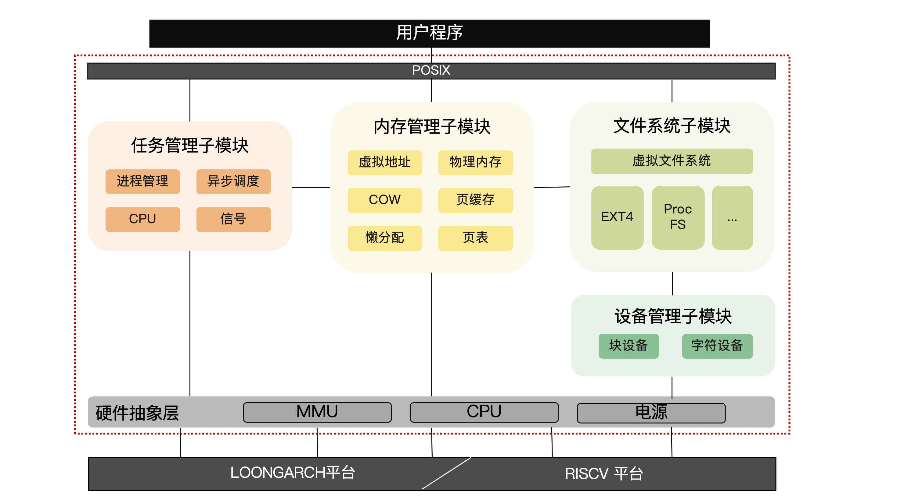
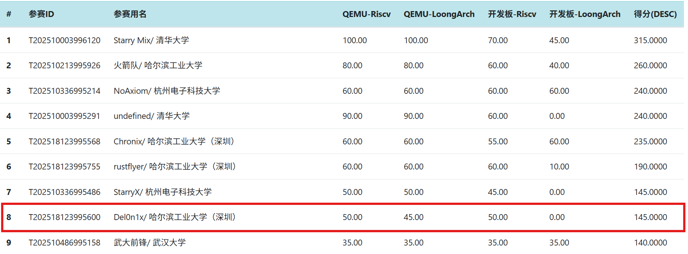
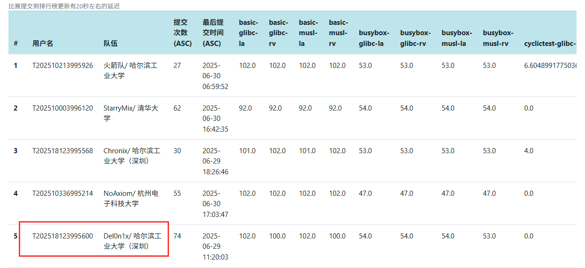

# Del0n1x


## 项目简介

[github仓库链接](https://github.com/Ya0rk/myOS): 欢迎向我们提出issue.

- 初赛阶段幻灯片、演示视频：[百度网盘](https://pan.baidu.com/s/19P5LKVmHvv3Uh7tCzk3CPA?pwd=nm92) 提取码: nm92
- 初赛文档：[Del0n1x初赛文档](./Del0n1x初赛文档.pdf)
- 决赛文档：[Del0n1x决赛文档](./Del0n1x决赛文档.pdf)
- 现场赛文档：[Del0n1x现场赛文档](./Del0n1x决赛现场赛文档.pdf)

Del0n1x 是一个使用 Rust 语言编写的同时适配 RISC-V64 和 LoongArch64 的跨平台操作系统，目标是实现一个 Linux 兼容的多核操作系统，支持进程调度、文件系统、网络等功能。
实现了对 RISC-V 和 LoongArch架构的统一支持，同一份内核代码可以在不同平台上编译运行，同时也适配了riscv星光二代板，龙芯星云板也能正常启动。Del0n1x也支持busybox、sh、
git、vi和llama2.c等现实应用。

| 模块  | 完成情况 |
| ---   | ---   |
| HAL模块  | 实现自己的HAL代码库，支持 RISCV64 和 LoongArch64 双架构    |
| 进程管理 | 无栈协程调度，支持全局统一的executor调度器； 实现多线程的资源回收； 统一进程和线程的数据结构    |
| 文件系统 | 实现dentry构建目录树； 实现页缓存和dentry缓存加快读写    |
| 内存管理 | 实现基本的内存管理功能； 实现CoW、懒分配内存优化    |
| 时钟模块 | 实现时间轮混合最小堆的数据结构管理方式； 支持定时器唤醒机制    |
| IPC系统 | 支持处理用户自定义信号和sigreturn机制； 实现支持读者写者同步的管道机制； 支持 System V 共享内存    |
| 网络模块 | 初步完成网络模块相关代码，通过了netperf网络测例    |
| 中断模块   | 支持外部中断，支持上板的串口中断处理    |



## 参赛成绩

8月20日决赛现场赛中，Del0n1x以145分的总分位列第8：


现场赛测例完成情况如下表：

| 平台      | 测例    | 完成情况                  |
| ------- | ----- | --------------------- |
| RV Qemu | git   | ✅Task0  ✅Task1 ❌Task2 |
|         | vim   | ✅Task0  ❌Task1        |
|         | gcc   | ✅Task0  ✅Task1        |
|         | rustc | ✅Task0  ❌Task1        |
| LA Qemu | git   | ✅Task0  ✅Task1 ❌Task2 |
|         | vim   | ✅Task0  ❌Task1        |
|         | gcc   | ✅Task0  ✅Task1        |
|         | rustc | ❌Task0  ❌Task1        |
| 星光二代板  | git   | ✅Task0  ✅Task1 ❌Task2 |
|         | vim   | ✅Task0  ❌Task1        |
|         | gcc   | ✅Task0  ✅Task1        |
|         | rustc | ✅Task0  ❌Task1        |
| 龙芯2K1000  |       | 测例运行失败                |

其中，RV Qemu、LA Qemu 平台使用`finet_qemu`分支进行测试，星光二代板平台使用`finet_vf2`分支进行测试。在`finet_lagcc`中，实现了 LA Qemu 平台下`gcc` Task1（编译、运行）测例的稳定运行。

截止8月17日决赛结束前，Del0n1x的排名如下（决赛测例满分）：


截至6月30日初赛结束前，Del0n1x的排名如下图：



## 目录架构

```
os
├── linker                  # 程序链接脚本
├── src
│   ├── boards              # 架构相关的参数
│   ├── driver              # 块设备驱动
│   ├── fs                  # 文件系统
│   ├── hal                 # 硬件抽象层
│   ├── ipc                 # 进程间通信相关的部分代码
│   ├── mm                  # 内存页表
│   ├── net                 # 网络
│   ├── signal              # 信号
│   ├── task                # TCB
│   ├── utils               # 一些工具
│   ├── sync                # 同步相关
│   ├── syscall             # 系统调用
│   ├── test                # 测试模块
│   ├── entry_la.asm        # 龙芯入口初始化汇编函数
│   ├── entry.asm           # riscv入口初始化函数
│   ├── console.rs
│   ├── lang_items.rs
│   ├── Makefile
│   └── main.rs
user                        # 用户程序
├── src
│   ├── bin
│   │   ├── autorun.rs      # 自动测试
│   │   ├── gbshell.rs      # glibc的busybox shell
│   │   ├── huge_write.rs   # 测试文件系统写入速度
│   │   ├── initproc.rs     # 调用user_shell，进入自己实现的终端
│   │   ├── mbshell.rs      # musl的busybox shell
│   │   └── user_shell.rs
doc                         # 设计文档
vendor                      # 第三方依赖
report                      # 过程文档
bootloader                  # 引导加载程序
```


## 运行项目

进入`cd os`文件，然后执行`make run ARCH=xxx OVERWRITE=true`

指令说明：

- 第一次运行需要在项目根目录准备`sdcard-rv.img`和`sdcard-la.img`(可以从官方的github测试仓库下载并编译)
- `ARCH`: 内核架构，如果不加该参数默认是`riscv`；如果需要龙芯，则：`ARCH = loongarch64`
- `OVERWRITE`：Del0n1x实现了真正的向镜像img读和写，为了避免破坏镜像，该参数回复制一份img用于挂载


## 项目调试

#### riscv64

进入`cd os`文件，然后执行`make gdbserver`，另外打开一个终端，执行`make gdbclient`.

#### loongarch64

进入`cd os`文件，然后执行`make gdbserver ARCH=loongarch64`，另外打开一个终端，执行`make LAgdbclient`.


## 项目成员

- 姚俊杰(345024941@qq.com): 进程模块、信号模块、网络模块等
- 林顺喆(yuanmu2004@163.com): 内存模块、龙芯适配等
- 卢家鼎(1277319667@qq.com): 文件系统、块设备等
- 指导老师：夏文  仇洁婷

## 未来计划

- 完善net模块，支持网络上板。
- 完善loop设备，实现功能更加完善的mount机制。
- 支持更多现实应用。

## 参考

- [Phoenix](https://github.com/ChenRuiwei/Phoenix)：无栈协程、内存管理
- [Polyhal](https://github.com/Byte-OS/polyhal)，[NPUCore-­IMPACT](https://gitlab.eduxiji.net/educg-group-26011-2376549/T202410699992496-312)： 硬件抽象层
- [Phoenix](https://github.com/ChenRuiwei/Phoenix)、[MinotaurOS](https://github.com/Dr-TSNG/MinotaurOS)：设计文档模板
- [MankorOs](https://gitlab.eduxiji.net/MankorOS/OSKernel2023-MankorOS)：星光二板块设备驱动

## 工具链

`cargo`:

```
❯ cargo version
cargo 1.86.0-nightly (088d49608 2025-01-10)2025-01-10
```

`Rust工具链`:

```
loongarch64-unknown-linux-gnu
loongarch64-unknown-none
riscv64gc-unknown-linux-musl
riscv64gc-unknown-none-elf
```

`qemu`:

```
❯ qemu-system-riscv64 --version
QEMU emulator version 9.2.1
Copyright (c) 2003-2024 Fabrice Bellard and the QEMU Project developers
❯ qemu-system-loongarch64 --version
QEMU emulator version 9.2.1
Copyright (c) 2003-2024 Fabrice Bellard and the QEMU Project developers
```

`riscv64-unknown-elf-gdb`: 

```
❯ riscv64-unknown-elf-gdb --version
GNU gdb (GDB) 16.2
Copyright (C) 2024 Free Software Foundation, Inc.
License GPLv3+: GNU GPL version 3 or later <http://gnu.org/licenses/gpl.html>
This is free software: you are free to change and redistribute it.
There is NO WARRANTY, to the extent permitted by law.
```

`loongarch64-unknown-linux-gnu-gdb`:

```
❯ loongarch64-unknown-linux-gnu-gdb --version
GNU gdb (GDB) 16.2
Copyright (C) 2024 Free Software Foundation, Inc.
License GPLv3+: GNU GPL version 3 or later <http://gnu.org/licenses/gpl.html>
This is free software: you are free to change and redistribute it.
There is NO WARRANTY, to the extent permitted by law.
```

其余工具链可以通过[官方链接](https://github.com/oscomp/testsuits-for-oskernel/tree/pre-2025?tab=readme-ov-file)中的Dockerfile下载.