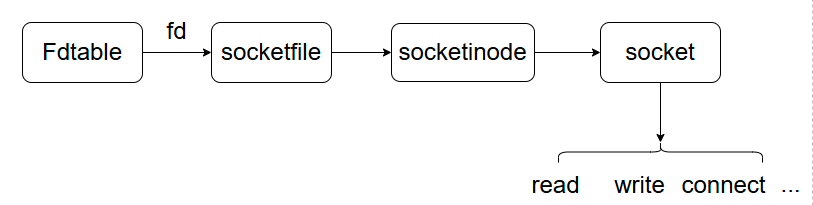
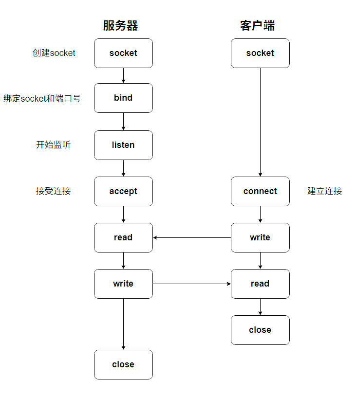
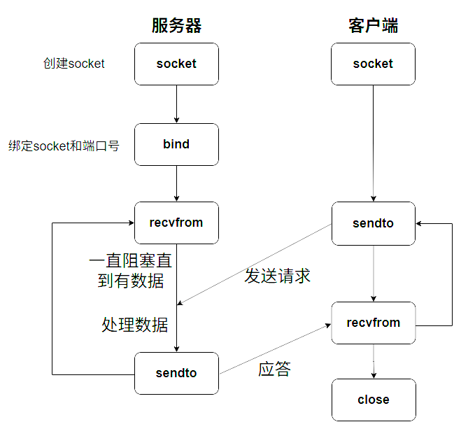
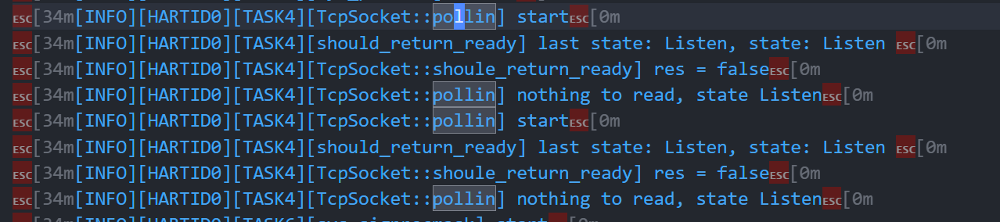
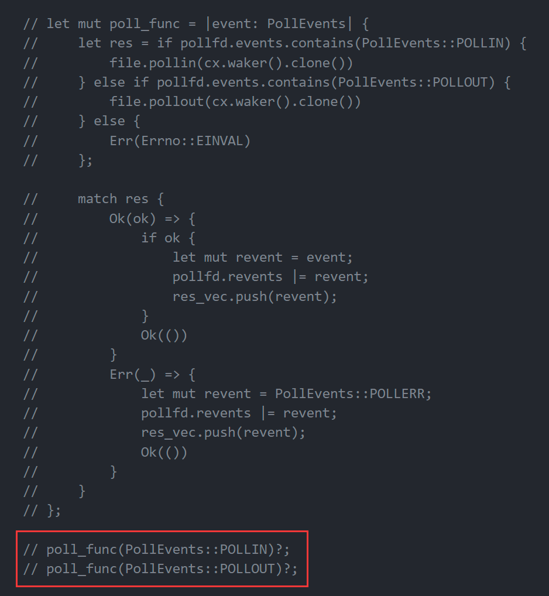
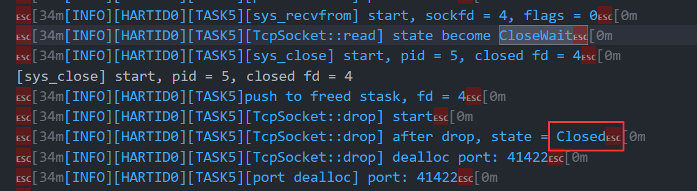
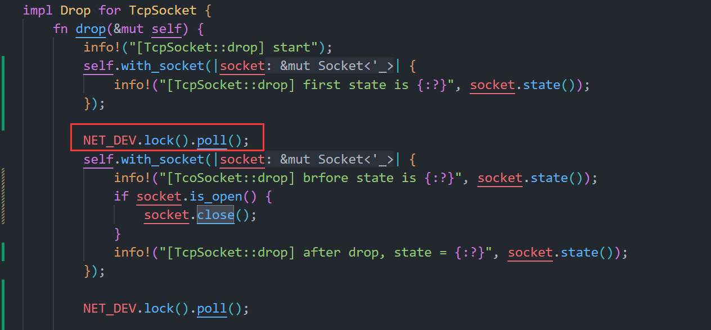
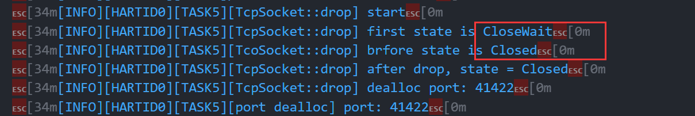

## Socket 设计

众所周知，Linux 下一切皆文件。无论是普通文件（如 file.txt），还是特殊文件（包括网络套接字），我们都可以以处理文件的方式来访问它们。
网络套接字（Socket）作为一种特殊的文件，提供了应用程序与网络协议栈之间的接口，使得不同主机上的应用程序能够进行数据交换。

### socket 与 文件系统的关联

为了通过统一的文件描述符操作socket，我们为socket设计了socketfs，其中包含socketinode和socketfile，主要发挥作用的是socketfile。
这里我将socketfile设计为一个中转层，当read 或 write 等syscall处理socket时，会调用到socketfile中的read 、 write接口，这里面主要是
将处理转发给net模块中的底层recv_msg 和 send_msg 函数，底层中不同的socket（如udp tcp等）可以实现不同的接口操作。

### 管理

在socket结构体中维护socketfile，socketfile维护socketinode，socketinode中维护dyn socket，fdtable中维护socketfile的FdInfo。

从fdtable到dyn socket流程如下：

我们为socketinode实现了InodeTrait，所以socketinode可以隐式转化为dyn InodeTrait，然后维护在socketfile的FileMeta中。
由于我们通过socketfile只能获得dyn InodeTrait对象，所以需要使用rust中的反向转化，将`Arc<dyn InodeTrait> → Arc<SocketInode>`。

### socketfile建立

- 当通过`sys_socket()`时，需要为socket建立对应的socketfile，并将其放入对应进程的fdtable中管理

- 当通过`accept()`时，服务器端需要新建一个socket用于和客户端通信，这里也需要建立socketfile

将socket存放在fdtable的过程主要在`sock_map_fd`中。

## Tcp

tcp 链接建立过程中服务器和用户的函数过程如下：

{: width=80% height="500px"}

`bind()`: bind() 是 TCP 服务器端的关键步骤，它的作用是将 ​​Socket​​ 绑定到 ​​特定的 IP 地址和端口​​，以便客户端能够找到并连接服务器。

**为什么需要 bind()？​​**

- ​​标识服务器位置​​：
客户端需要知道服务器的 ​​IP 地址​​ 和 ​​端口号​​ 才能发起连接。bind() 的作用就是告诉操作系统：
​​“我的服务在这个 IP 和端口上监听，所有发往这里的 TCP 连接都交给我处理。”​​
​​
- 避免端口冲突​​：
如果多个程序尝试监听同一个端口，bind() 会失败（Address already in use），防止端口被重复占用。

`accept()` 返回一个新的文件描述符，指向一个连接到客户的新的套接字文件。而用于监听的套接口仍然是未连接的，并准备接收下一个连接。

## Udp

udp 是无连接的，可以直接通过 sendto 和 recvfrom 系统调用实现客户端和服务器的通信。
sendto 底层调用 send_msg, recv_from底层调用 recv_msg。

## debug

### 端口复用

在测试 iperf 中发现，其中一个测试用例 `iperf PARALLEL_UDP` 出现死循环情况，发现
client发送已经发送了数据，但是server那边并没有接受到。

通过日志查看，在server中，调用sys_bind前会调用 `sys_setsockopt` 并且传入 `SO_REUSEADDR` 实现地址复用，
所以这里在 udp 的 sys_bind 中我们需要实现他的地址复用。

### pselect的future连续poll两次问题

在netperf的第一个测例中，发现pselect会连续poll两次pollin event，这会导致poll中revent计数错误（多加了1），
然后造成任务提前exit，导致卡死。

审查代码发现原来的逻辑有问题，我们调用了两次`poll_func`函数，这没问题，
但是每次调用都会检查相同的项（如POLLIN），所以如果本轮循环是POLLIN事件，
那么就会调用两次`file.pollin`,`res_vec`中的多push一个POLLIN事件，计数错误。
修改逻辑后解决问题。

### tcp state变化跳跃

在netperf的最后一个测例TCP_CRR中发现，tcpsocket状态前一个是 CloseWait，
在经过Tcp drop中 NET_DEV poll轮循后变为了 Close，中间跳过了 LaskAck状态；

打印日志发现，调用第一个 NET_DEV poll轮循后，直接变为了 Close。

